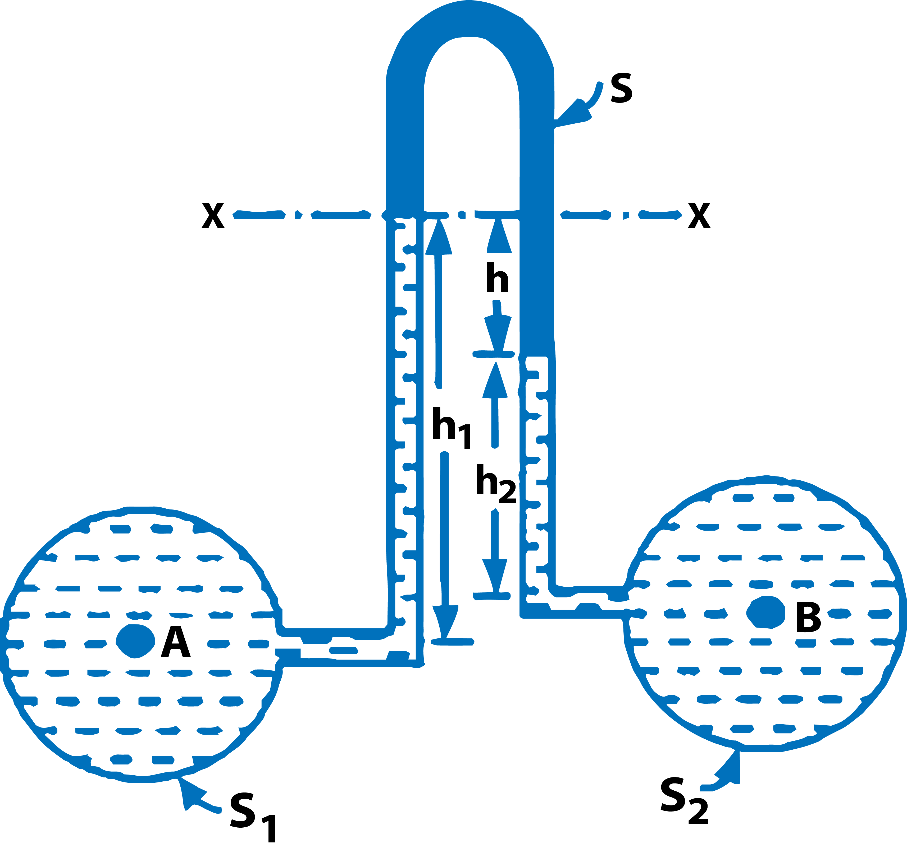

<h2>Inverted U-tube Differential Manometer</h2>

 It consists of an inverted U-tube, containing a light liquid. The two ends of the tube are connected to the points whose difference of pressure is to be measured. It is used for measuring difference of low pressures.

 

$$ Fig.1\ Inverted\ U\ Tube\ Differential\ Manometer $$

 

Fig. 1 shows an inverted U-tube differential manometer connected to the two points A and B. Let the pressure at A is more than the pressure at B.

Let

&emsp;&emsp; h1 = Height of liquid in left limb below the datum line X-X   
&emsp;&emsp; h2 = Height of liquid in right limb   
&emsp;&emsp; h =  Difference of light liquid   
&emsp;&emsp; &rho;1 = Density of liquid at A   
&emsp;&emsp; &rho;2 = Density of liquid at B   
&emsp;&emsp; &rho;s = Density of light liquid   
&emsp;&emsp; PA = Pressure at A   
&emsp;&emsp; PB = Pressure at B   

Taking X-X as datum line. Then pressure in the left limb below X-X

$$ = P_A - \rho_1 × g × h_1 $$

Pressure in the right limb below X-X

$$ = P_B - \rho_2 × g × h_2 - \rho_s × g × h $$

Equating the two pressure

$$ P_A - \rho_1 × g × h_1 = P_B - \rho_2 × g × h_2 - \rho_s × g × h $$
$$ P_A - P_B = \rho_1 × g × h_1 - \rho_2 × g × h_2 - \rho_s × g × h $$